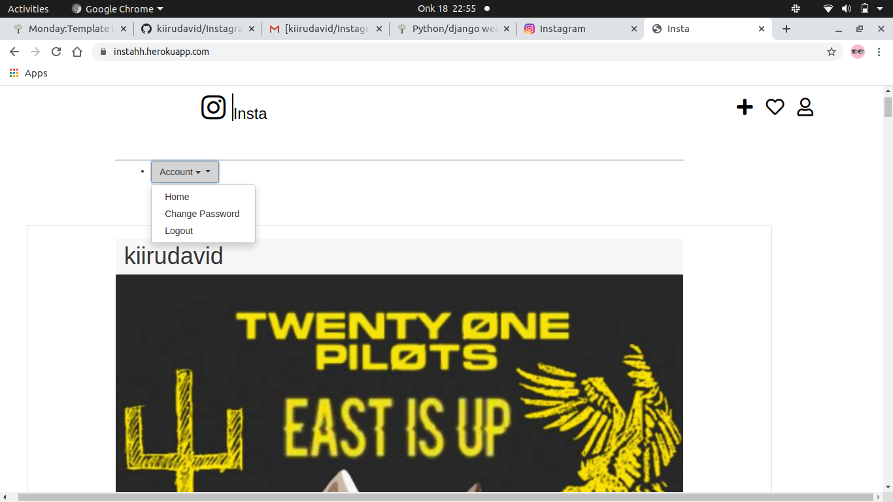

# Instagram clone

## Author

* **David Kiiru**
 
 

## Description
The app is a photo sharing app which allows users to assign filters to photos and share them with followers. ... Insta_Liters can sync their photo sharing to other social networks, so Instagram photos can be posted directly to Facebook, Tumblr, Twitter, Flickr, and Foursquare.. Visit the live site on
## User story

As a user of the web application you will be able to:

1. Sign up and log in
2. View photos posted by other users
3. Follow other users
4. Comment on photos
5. Edit your profile
## BDD
| Behavior            | Input                         | Output                        | 
| ------------------- | ----------------------------- | ----------------------------- |
| User visits the app and gets redirected to the login page  | User logs in | Directed to the home page where they see posted photos | 
If user has no account, they click on `sign up` | User signs up | User is redirected to the log in page |
|  Home page loads | Add comment  | Comment posted appears |
|  Homepage loads | Click `profile` | User's profile appears | 
| Homepage loads | Click `upload image` icon | User's redirected to a page where they can upload an image | 
| Homepage loads | Click `settings` icon | A modal appears where one can change their password or logout | 
| Homepage loads | User inputs in the search form and presses enter | Searched results show |
| A list of users displays | Click `follow` button to follow | Reloaded to the homepage

## Setup and Installation  
To get the project .......  
#### Cloning the repository:  

##### Navigate into the folder and install requirements  
 ```bash 
cd gallery pipenv  install -r requirements.txt 
```
##### Install and activate Virtual  
 ```bash 
- python3 -m venv virtual - source virtual/bin/activate  
```  
##### Install Dependencies  
 ```bash 
 pipenv install -r requirements.txt 
```  
 ##### Setup Database  
  SetUp your database User,Password, Host then make migrate  
 ```bash 
python manage.py makemigrations gallery
 ``` 
 Now Migrate  
 ```bash 
 python manage.py migrate 
```
##### Run the application  
 ```bash 
 python manage.py runserver 
```  

##### Testing the application  
 ```bash 
 python manage.py test 
```
Open the application on your browser `127.0.0.1:8000`.  
  
  
## Technology used  
  
* [Python3.6](https://www.python.org/)  
* [Django 2.2.9](https://docs.djangoproject.com/en/2.2/)  
* [Heroku](https://heroku.com)  
* [Git](for version control)
  
  
## Known Bugs  
* There are no known bugs currently,though i encountered many of it during deployment,but i finally managed 
## Support and contact details
call me on

:0713275530

 :davidmaina085@gmail.com

## License

[MIT License](LICENSE.md)
Copyright (c) [2020] [David kiiru]

